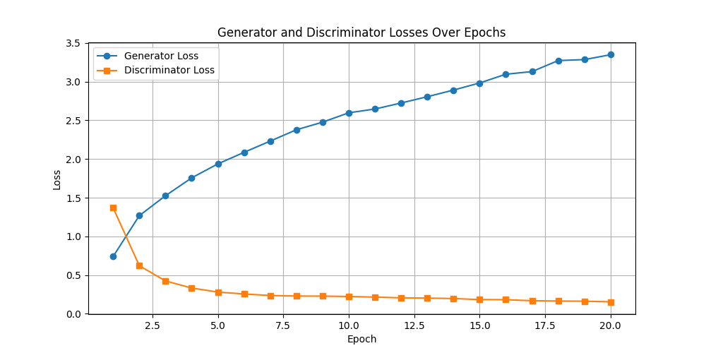
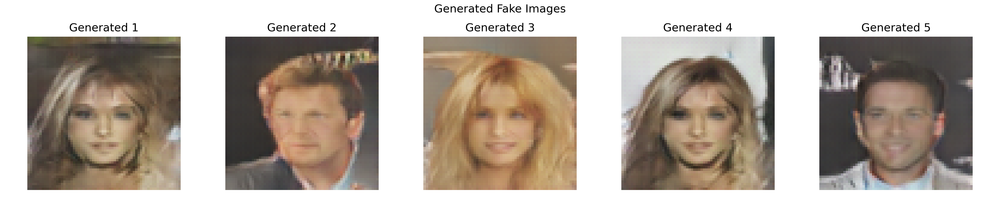

# GAN Lab - Assignment 3

## Overview
This repository contains the implementation of a Deep Convolutional Generative Adversarial Network (DCGAN) for generating fake human face images using the CelebA dataset. The project includes training and testing scripts, model architectures, and visualization of results.

- **GitHub Repository**: [https://github.com/vaibhav7766/GAN_lab/tree/main/Assignment3](https://github.com/vaibhav7766/GAN_lab/tree/main/Assignment3)
- **Author**: Vaibhav Sharma

## Model Architecture
The DCGAN architecture follows the design proposed by Radford et al. (2015). The Generator upsamples random noise into 64x64 RGB images using transposed convolutions, while the Discriminator downsamples images to classify them as real or fake.

> Source: "Unsupervised Representation Learning with Deep Convolutional Generative Adversarial Networks" by Radford et al. (2015)

## Dataset Preprocessing Steps
1. **Dataset Source**: The CelebA dataset is used, located in the `data` directory. Download the dataset via [kaggle](https://www.kaggle.com/datasets/jessicali9530/celeba-dataset)
2. **Transformations**:
   - Images are resized to 64x64 pixels using `transforms.Resize((64, 64))`.
   - Converted to tensor format with `transforms.ToTensor()`.
   - Normalized to the range [-1, 1] using `transforms.Normalize((0.5, 0.5, 0.5), (0.5, 0.5, 0.5))` to match the Tanh activation output of the Generator.
3. **DataLoader**: A `torch.utils.data.DataLoader` is created with a batch size of 16, shuffling enabled, and 4 worker threads for efficient data loading.

## How to Train and Test the Model
### Prerequisites
- Python 3.10.3
- PyTorch, torchvision, pandas, matplotlib, tqdm, and numpy libraries
- CelebA dataset in the `data` directory
- GPU (optional) for faster training

### Training the Model
1. **Setup**:
   - Ensure the `data` directory contains the CelebA dataset.
   - Install required libraries: `pip install torch torchvision pandas matplotlib tqdm`.
2. **Run the Training Script**:
   - Execute the provided Jupyter notebook or convert it to a `.py` file and run with `python train.py`.
   - The script will:
     - Initialize the Generator and Discriminator models.
     - Set hyperparameters: `latent_dim=100`, `batch_size=16`, `gen_lr=2e-4`, `disc_lr=2e-4`, `n_gen_updates=4`, `total_epochs=20`.
     - Train the model on the preprocessed dataset, saving checkpoints to the `checkpoints` directory (e.g., `generator_epoch_20.pth`) and losses to `losses.csv`.
     - Generate plots of training losses saved as `images/loss_plot.png`.
3. **Output**:
   - Progress is displayed using `tqdm`, showing per-batch and average epoch losses.
   - Training completes after 20 epochs, printing "Training completed!".

### Testing the Model
1. **Setup**:
   - Ensure the trained model checkpoint (`checkpoints/generator_epoch_20.pth`) is available.
2. **Run the Testing Script**:
   - Continue in the same notebook or run the testing cells.
   - The script loads the pre-trained Generator, generates 5 fake images from random noise, and plots them.
3. **Output**:
   - Fake images are saved as `images/generated_images.png` and displayed.

## Expected Outputs
### Training Outputs
- **Loss Plot**: A graph showing Generator and Discriminator losses over 20 epochs, similar to the example below. Ideally, the Generator loss should increase while the Discriminator loss stabilizes or decreases, indicating balanced training.
  
- **Checkpoints**: Model weights saved in `checkpoints/` (e.g., `generator_epoch_20.pth`, `discriminator_epoch_20.pth`).
- **Loss Data**: A `losses.csv` file with columns `Epoch`, `Gen Loss`, and `Disc Loss`.

### Testing Outputs
- **Generated Images**: Five 64x64 fake face images arranged in a row, labeled "Generated 1" to "Generated 5", saved as `images/generated_images.png`. An example is shown below, where the images resemble human faces with varying quality depending on training success.
  

## Notes
- The quality of generated images improves with more epochs or hyperparameter tuning.
- Ensure sufficient disk space for checkpoints and images.
- For better results, consider using a GPU and increasing `total_epochs` if computational resources allow.

## Acknowledgments
- Inspired by the DCGAN paper: Radford, A., Metz, L., & Chintala, S. (2015). *Unsupervised Representation Learning with Deep Convolutional Generative Adversarial Networks*.